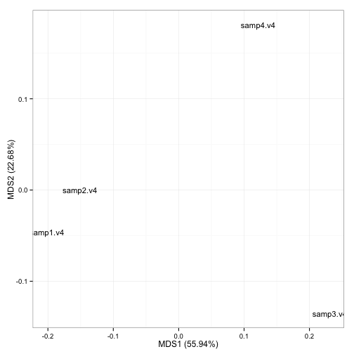
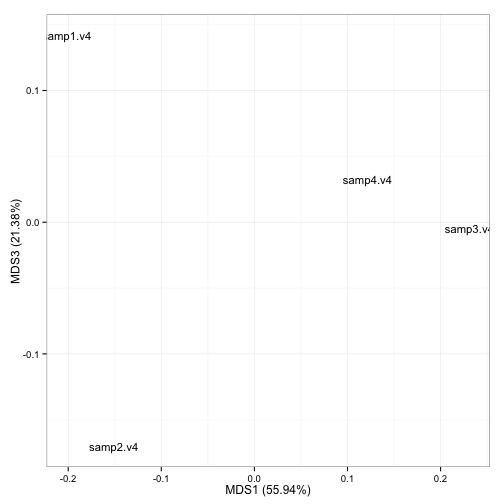
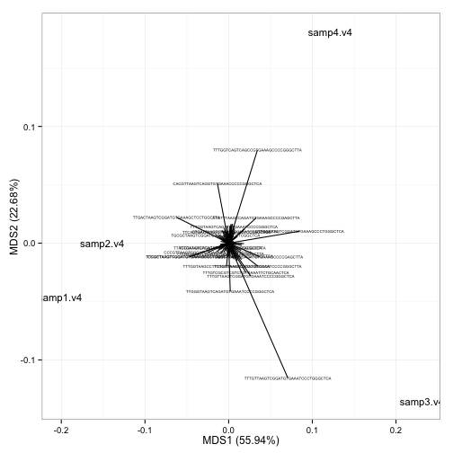
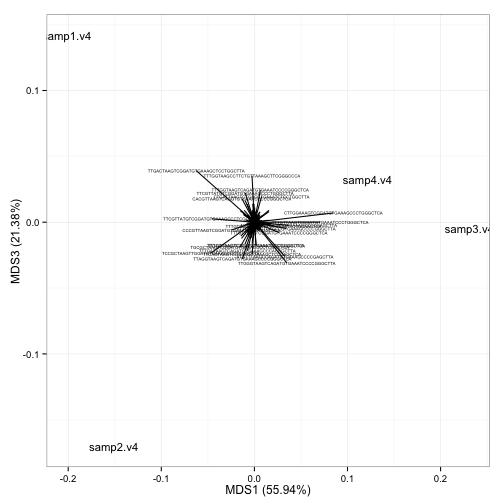

```r
#!/usr/bin/env Rscript
```

# Introduction 
Some text


## PCoA plots

 
 
<script src="CanvasMatrix.js" type="text/javascript"></script>
<canvas id="pcoa_3DtextureCanvas" style="display: none;" width="256" height="256">
Your browser does not support the HTML5 canvas element.</canvas>
<!-- ****** points object 7 ****** -->
<script id="pcoa_3Dvshader7" type="x-shader/x-vertex">
attribute vec3 aPos;
attribute vec4 aCol;
uniform mat4 mvMatrix;
uniform mat4 prMatrix;
varying vec4 vCol;
varying vec4 vPosition;
void main(void) {
vPosition = mvMatrix * vec4(aPos, 1.);
gl_Position = prMatrix * vPosition;
gl_PointSize = 10.;
vCol = aCol;
}
</script>
<script id="pcoa_3Dfshader7" type="x-shader/x-fragment"> 
#ifdef GL_ES
precision highp float;
#endif
varying vec4 vCol; // carries alpha
varying vec4 vPosition;
void main(void) {
vec4 colDiff = vCol;
vec4 lighteffect = colDiff;
gl_FragColor = lighteffect;
}
</script> 
<!-- ****** text object 9 ****** -->
<script id="pcoa_3Dvshader9" type="x-shader/x-vertex">
attribute vec3 aPos;
attribute vec4 aCol;
uniform mat4 mvMatrix;
uniform mat4 prMatrix;
varying vec4 vCol;
varying vec4 vPosition;
attribute vec2 aTexcoord;
varying vec2 vTexcoord;
uniform vec2 textScale;
attribute vec2 aOfs;
void main(void) {
vCol = aCol;
vTexcoord = aTexcoord;
vec4 pos = prMatrix * mvMatrix * vec4(aPos, 1.);
pos = pos/pos.w;
gl_Position = pos + vec4(aOfs*textScale, 0.,0.);
}
</script>
<script id="pcoa_3Dfshader9" type="x-shader/x-fragment"> 
#ifdef GL_ES
precision highp float;
#endif
varying vec4 vCol; // carries alpha
varying vec4 vPosition;
varying vec2 vTexcoord;
uniform sampler2D uSampler;
void main(void) {
vec4 colDiff = vCol;
vec4 lighteffect = colDiff;
vec4 textureColor = lighteffect*texture2D(uSampler, vTexcoord);
if (textureColor.a < 0.1)
discard;
else
gl_FragColor = textureColor;
}
</script> 
<!-- ****** text object 10 ****** -->
<script id="pcoa_3Dvshader10" type="x-shader/x-vertex">
attribute vec3 aPos;
attribute vec4 aCol;
uniform mat4 mvMatrix;
uniform mat4 prMatrix;
varying vec4 vCol;
varying vec4 vPosition;
attribute vec2 aTexcoord;
varying vec2 vTexcoord;
uniform vec2 textScale;
attribute vec2 aOfs;
void main(void) {
vCol = aCol;
vTexcoord = aTexcoord;
vec4 pos = prMatrix * mvMatrix * vec4(aPos, 1.);
pos = pos/pos.w;
gl_Position = pos + vec4(aOfs*textScale, 0.,0.);
}
</script>
<script id="pcoa_3Dfshader10" type="x-shader/x-fragment"> 
#ifdef GL_ES
precision highp float;
#endif
varying vec4 vCol; // carries alpha
varying vec4 vPosition;
varying vec2 vTexcoord;
uniform sampler2D uSampler;
void main(void) {
vec4 colDiff = vCol;
vec4 lighteffect = colDiff;
vec4 textureColor = lighteffect*texture2D(uSampler, vTexcoord);
if (textureColor.a < 0.1)
discard;
else
gl_FragColor = textureColor;
}
</script> 
<!-- ****** text object 11 ****** -->
<script id="pcoa_3Dvshader11" type="x-shader/x-vertex">
attribute vec3 aPos;
attribute vec4 aCol;
uniform mat4 mvMatrix;
uniform mat4 prMatrix;
varying vec4 vCol;
varying vec4 vPosition;
attribute vec2 aTexcoord;
varying vec2 vTexcoord;
uniform vec2 textScale;
attribute vec2 aOfs;
void main(void) {
vCol = aCol;
vTexcoord = aTexcoord;
vec4 pos = prMatrix * mvMatrix * vec4(aPos, 1.);
pos = pos/pos.w;
gl_Position = pos + vec4(aOfs*textScale, 0.,0.);
}
</script>
<script id="pcoa_3Dfshader11" type="x-shader/x-fragment"> 
#ifdef GL_ES
precision highp float;
#endif
varying vec4 vCol; // carries alpha
varying vec4 vPosition;
varying vec2 vTexcoord;
uniform sampler2D uSampler;
void main(void) {
vec4 colDiff = vCol;
vec4 lighteffect = colDiff;
vec4 textureColor = lighteffect*texture2D(uSampler, vTexcoord);
if (textureColor.a < 0.1)
discard;
else
gl_FragColor = textureColor;
}
</script> 
<!-- ****** text object 12 ****** -->
<script id="pcoa_3Dvshader12" type="x-shader/x-vertex">
attribute vec3 aPos;
attribute vec4 aCol;
uniform mat4 mvMatrix;
uniform mat4 prMatrix;
varying vec4 vCol;
varying vec4 vPosition;
attribute vec2 aTexcoord;
varying vec2 vTexcoord;
uniform vec2 textScale;
attribute vec2 aOfs;
void main(void) {
vCol = aCol;
vTexcoord = aTexcoord;
vec4 pos = prMatrix * mvMatrix * vec4(aPos, 1.);
pos = pos/pos.w;
gl_Position = pos + vec4(aOfs*textScale, 0.,0.);
}
</script>
<script id="pcoa_3Dfshader12" type="x-shader/x-fragment"> 
#ifdef GL_ES
precision highp float;
#endif
varying vec4 vCol; // carries alpha
varying vec4 vPosition;
varying vec2 vTexcoord;
uniform sampler2D uSampler;
void main(void) {
vec4 colDiff = vCol;
vec4 lighteffect = colDiff;
vec4 textureColor = lighteffect*texture2D(uSampler, vTexcoord);
if (textureColor.a < 0.1)
discard;
else
gl_FragColor = textureColor;
}
</script> 
<!-- ****** lines object 13 ****** -->
<script id="pcoa_3Dvshader13" type="x-shader/x-vertex">
attribute vec3 aPos;
attribute vec4 aCol;
uniform mat4 mvMatrix;
uniform mat4 prMatrix;
varying vec4 vCol;
varying vec4 vPosition;
void main(void) {
vPosition = mvMatrix * vec4(aPos, 1.);
gl_Position = prMatrix * vPosition;
vCol = aCol;
}
</script>
<script id="pcoa_3Dfshader13" type="x-shader/x-fragment"> 
#ifdef GL_ES
precision highp float;
#endif
varying vec4 vCol; // carries alpha
varying vec4 vPosition;
void main(void) {
vec4 colDiff = vCol;
vec4 lighteffect = colDiff;
gl_FragColor = lighteffect;
}
</script> 
<!-- ****** text object 14 ****** -->
<script id="pcoa_3Dvshader14" type="x-shader/x-vertex">
attribute vec3 aPos;
attribute vec4 aCol;
uniform mat4 mvMatrix;
uniform mat4 prMatrix;
varying vec4 vCol;
varying vec4 vPosition;
attribute vec2 aTexcoord;
varying vec2 vTexcoord;
uniform vec2 textScale;
attribute vec2 aOfs;
void main(void) {
vCol = aCol;
vTexcoord = aTexcoord;
vec4 pos = prMatrix * mvMatrix * vec4(aPos, 1.);
pos = pos/pos.w;
gl_Position = pos + vec4(aOfs*textScale, 0.,0.);
}
</script>
<script id="pcoa_3Dfshader14" type="x-shader/x-fragment"> 
#ifdef GL_ES
precision highp float;
#endif
varying vec4 vCol; // carries alpha
varying vec4 vPosition;
varying vec2 vTexcoord;
uniform sampler2D uSampler;
void main(void) {
vec4 colDiff = vCol;
vec4 lighteffect = colDiff;
vec4 textureColor = lighteffect*texture2D(uSampler, vTexcoord);
if (textureColor.a < 0.1)
discard;
else
gl_FragColor = textureColor;
}
</script> 
<!-- ****** lines object 15 ****** -->
<script id="pcoa_3Dvshader15" type="x-shader/x-vertex">
attribute vec3 aPos;
attribute vec4 aCol;
uniform mat4 mvMatrix;
uniform mat4 prMatrix;
varying vec4 vCol;
varying vec4 vPosition;
void main(void) {
vPosition = mvMatrix * vec4(aPos, 1.);
gl_Position = prMatrix * vPosition;
vCol = aCol;
}
</script>
<script id="pcoa_3Dfshader15" type="x-shader/x-fragment"> 
#ifdef GL_ES
precision highp float;
#endif
varying vec4 vCol; // carries alpha
varying vec4 vPosition;
void main(void) {
vec4 colDiff = vCol;
vec4 lighteffect = colDiff;
gl_FragColor = lighteffect;
}
</script> 
<!-- ****** text object 16 ****** -->
<script id="pcoa_3Dvshader16" type="x-shader/x-vertex">
attribute vec3 aPos;
attribute vec4 aCol;
uniform mat4 mvMatrix;
uniform mat4 prMatrix;
varying vec4 vCol;
varying vec4 vPosition;
attribute vec2 aTexcoord;
varying vec2 vTexcoord;
uniform vec2 textScale;
attribute vec2 aOfs;
void main(void) {
vCol = aCol;
vTexcoord = aTexcoord;
vec4 pos = prMatrix * mvMatrix * vec4(aPos, 1.);
pos = pos/pos.w;
gl_Position = pos + vec4(aOfs*textScale, 0.,0.);
}
</script>
<script id="pcoa_3Dfshader16" type="x-shader/x-fragment"> 
#ifdef GL_ES
precision highp float;
#endif
varying vec4 vCol; // carries alpha
varying vec4 vPosition;
varying vec2 vTexcoord;
uniform sampler2D uSampler;
void main(void) {
vec4 colDiff = vCol;
vec4 lighteffect = colDiff;
vec4 textureColor = lighteffect*texture2D(uSampler, vTexcoord);
if (textureColor.a < 0.1)
discard;
else
gl_FragColor = textureColor;
}
</script> 
<!-- ****** lines object 17 ****** -->
<script id="pcoa_3Dvshader17" type="x-shader/x-vertex">
attribute vec3 aPos;
attribute vec4 aCol;
uniform mat4 mvMatrix;
uniform mat4 prMatrix;
varying vec4 vCol;
varying vec4 vPosition;
void main(void) {
vPosition = mvMatrix * vec4(aPos, 1.);
gl_Position = prMatrix * vPosition;
vCol = aCol;
}
</script>
<script id="pcoa_3Dfshader17" type="x-shader/x-fragment"> 
#ifdef GL_ES
precision highp float;
#endif
varying vec4 vCol; // carries alpha
varying vec4 vPosition;
void main(void) {
vec4 colDiff = vCol;
vec4 lighteffect = colDiff;
gl_FragColor = lighteffect;
}
</script> 
<!-- ****** text object 18 ****** -->
<script id="pcoa_3Dvshader18" type="x-shader/x-vertex">
attribute vec3 aPos;
attribute vec4 aCol;
uniform mat4 mvMatrix;
uniform mat4 prMatrix;
varying vec4 vCol;
varying vec4 vPosition;
attribute vec2 aTexcoord;
varying vec2 vTexcoord;
uniform vec2 textScale;
attribute vec2 aOfs;
void main(void) {
vCol = aCol;
vTexcoord = aTexcoord;
vec4 pos = prMatrix * mvMatrix * vec4(aPos, 1.);
pos = pos/pos.w;
gl_Position = pos + vec4(aOfs*textScale, 0.,0.);
}
</script>
<script id="pcoa_3Dfshader18" type="x-shader/x-fragment"> 
#ifdef GL_ES
precision highp float;
#endif
varying vec4 vCol; // carries alpha
varying vec4 vPosition;
varying vec2 vTexcoord;
uniform sampler2D uSampler;
void main(void) {
vec4 colDiff = vCol;
vec4 lighteffect = colDiff;
vec4 textureColor = lighteffect*texture2D(uSampler, vTexcoord);
if (textureColor.a < 0.1)
discard;
else
gl_FragColor = textureColor;
}
</script> 
<!-- ****** lines object 19 ****** -->
<script id="pcoa_3Dvshader19" type="x-shader/x-vertex">
attribute vec3 aPos;
attribute vec4 aCol;
uniform mat4 mvMatrix;
uniform mat4 prMatrix;
varying vec4 vCol;
varying vec4 vPosition;
void main(void) {
vPosition = mvMatrix * vec4(aPos, 1.);
gl_Position = prMatrix * vPosition;
vCol = aCol;
}
</script>
<script id="pcoa_3Dfshader19" type="x-shader/x-fragment"> 
#ifdef GL_ES
precision highp float;
#endif
varying vec4 vCol; // carries alpha
varying vec4 vPosition;
void main(void) {
vec4 colDiff = vCol;
vec4 lighteffect = colDiff;
gl_FragColor = lighteffect;
}
</script> 
<script type="text/javascript">
var min = Math.min;
var max = Math.max;
var sqrt = Math.sqrt;
var sin = Math.sin;
var acos = Math.acos;
var tan = Math.tan;
var SQRT2 = Math.SQRT2;
var PI = Math.PI;
var log = Math.log;
var exp = Math.exp;
var rglClass = function() {
this.zoom = new Array();
this.FOV  = new Array();
this.userMatrix = new Array();
this.viewport = new Array();
this.listeners = new Array();
this.clipplanes = new Array();
this.opaque = new Array();
this.transparent = new Array();
this.subscenes = new Array();
this.flags = new Array();
this.prog = new Array();
this.ofsLoc = new Array();
this.origLoc = new Array();
this.sizeLoc = new Array();
this.usermatLoc = new Array();
this.vClipplane = new Array();
this.texture = new Array();
this.texLoc = new Array();
this.sampler = new Array();
this.origsize = new Array();
this.values = new Array();
this.normLoc = new Array();
this.clipLoc = new Array();
this.centers = new Array();
this.f = new Array();
this.buf = new Array();
this.ibuf = new Array();
this.mvMatLoc = new Array();
this.prMatLoc = new Array();
this.textScaleLoc = new Array();
this.normMatLoc = new Array();
this.IMVClip = new Array();
this.drawFns = new Array();
this.clipFns = new Array();
this.prMatrix = new CanvasMatrix4();
this.mvMatrix = new CanvasMatrix4();
this.vp = null;
this.prmvMatrix = null;
this.origs = null;
};
(function() {
this.getShader = function( gl, id ){
var shaderScript = document.getElementById ( id );
var str = "";
var k = shaderScript.firstChild;
while ( k ){
if ( k.nodeType == 3 ) str += k.textContent;
k = k.nextSibling;
}
var shader;
if ( shaderScript.type == "x-shader/x-fragment" )
shader = gl.createShader ( gl.FRAGMENT_SHADER );
else if ( shaderScript.type == "x-shader/x-vertex" )
shader = gl.createShader(gl.VERTEX_SHADER);
else return null;
gl.shaderSource(shader, str);
gl.compileShader(shader);
if (gl.getShaderParameter(shader, gl.COMPILE_STATUS) == 0)
alert(gl.getShaderInfoLog(shader));
return shader;
}
this.multMV = function(M, v) {
return [M.m11*v[0] + M.m12*v[1] + M.m13*v[2] + M.m14*v[3],
M.m21*v[0] + M.m22*v[1] + M.m23*v[2] + M.m24*v[3],
M.m31*v[0] + M.m32*v[1] + M.m33*v[2] + M.m34*v[3],
M.m41*v[0] + M.m42*v[1] + M.m43*v[2] + M.m44*v[3]];
}
this.f_is_lit = 1;
this.f_is_smooth = 2;
this.f_has_texture = 4;
this.f_is_indexed = 8;
this.f_depth_sort = 16;
this.f_fixed_quads = 32;
this.f_is_transparent = 64;
this.f_is_lines = 128;
this.f_sprites_3d = 256;
this.f_sprite_3d = 512;
this.f_is_subscene = 1024;
this.f_is_clipplanes = 2048;
this.f_reuse = 4096;
this.whichList = function(id) {
if (this.flags[id] & this.f_is_subscene)
return "subscenes";
else if (this.flags[id] & this.f_is_clipplanes)
return "clipplanes";
else if (this.flags[id] & this.f_is_transparent)
return "transparent";
else
return "opaque"; 
}
this.inSubscene = function(id, subscene) {
var thelist = this.whichList(id);
return this[thelist][subscene].indexOf(id) > -1;
}
this.addToSubscene = function(id, subscene) {
var thelist = this.whichList(id);
if (this[thelist][subscene].indexOf(id) == -1)
this[thelist][subscene].push(id);
}
this.delFromSubscene = function(id, subscene) {
var thelist = this.whichList(id);
var i = this[thelist][subscene].indexOf(id);
if (i > -1)
this[thelist][subscene].splice(i, 1);
}
this.setSubsceneEntries = function(ids, subscene) {
this.subscenes[subscene] = [];
this.clipplanes[subscene] = [];
this.transparent[subscene] = [];
this.opaque[subscene] = [];
for (var i = 0; i < ids.length; i++)
this.addToSubscene(ids[i], subscene);
}
}).call(rglClass.prototype);
var pcoa_3Drgl = new rglClass();
pcoa_3Drgl.start = function() {
var debug = function(msg) {
document.getElementById("pcoa_3Ddebug").innerHTML = msg;
}
debug("");
var canvas = document.getElementById("pcoa_3Dcanvas");
if (!window.WebGLRenderingContext){
debug(" Your browser does not support WebGL. See <a href=\"http://get.webgl.org\">http://get.webgl.org</a>");
return;
}
var gl;
try {
// Try to grab the standard context. If it fails, fallback to experimental.
gl = canvas.getContext("webgl") 
|| canvas.getContext("experimental-webgl");
}
catch(e) {}
if ( !gl ) {
debug(" Your browser appears to support WebGL, but did not create a WebGL context.  See <a href=\"http://get.webgl.org\">http://get.webgl.org</a>");
return;
}
var width = 505;  var height = 505;
canvas.width = width;   canvas.height = height;
var normMatrix = new CanvasMatrix4();
var saveMat = new Object();
var distance;
var posLoc = 0;
var colLoc = 1;
var activeSubscene = 1;
this.flags[1] = 1192;
this.zoom[1] = 1;
this.FOV[1] = 30;
this.viewport[1] = [0, 0, 504, 504];
this.userMatrix[1] = new CanvasMatrix4();
this.userMatrix[1].load([
1, 0, 0, 0,
0, 0.3420201, -0.9396926, 0,
0, 0.9396926, 0.3420201, 0,
0, 0, 0, 1
]);
this.clipplanes[1] = [];
this.opaque[1] = [7,9,10,11,12,13,14,15,16,17,18,19];
this.transparent[1] = [];
this.subscenes[1] = [];
function getPowerOfTwo(value) {
var pow = 1;
while(pow<value) {
pow *= 2;
}
return pow;
}
function handleLoadedTexture(texture, textureCanvas) {
gl.pixelStorei(gl.UNPACK_FLIP_Y_WEBGL, true);
gl.bindTexture(gl.TEXTURE_2D, texture);
gl.texImage2D(gl.TEXTURE_2D, 0, gl.RGBA, gl.RGBA, gl.UNSIGNED_BYTE, textureCanvas);
gl.texParameteri(gl.TEXTURE_2D, gl.TEXTURE_MAG_FILTER, gl.LINEAR);
gl.texParameteri(gl.TEXTURE_2D, gl.TEXTURE_MIN_FILTER, gl.LINEAR_MIPMAP_NEAREST);
gl.generateMipmap(gl.TEXTURE_2D);
gl.bindTexture(gl.TEXTURE_2D, null);
}
function loadImageToTexture(filename, texture) {   
var canvas = document.getElementById("pcoa_3DtextureCanvas");
var ctx = canvas.getContext("2d");
var image = new Image();
image.onload = function() {
var w = image.width;
var h = image.height;
var canvasX = getPowerOfTwo(w);
var canvasY = getPowerOfTwo(h);
canvas.width = canvasX;
canvas.height = canvasY;
ctx.imageSmoothingEnabled = true;
ctx.drawImage(image, 0, 0, canvasX, canvasY);
handleLoadedTexture(texture, canvas);
pcoa_3Drgl.drawScene();
}
image.src = filename;
}  	   
function drawTextToCanvas(text, cex) {
var canvasX, canvasY;
var textX, textY;
var textHeight = 20 * cex;
var textColour = "white";
var fontFamily = "Arial";
var backgroundColour = "rgba(0,0,0,0)";
var canvas = document.getElementById("pcoa_3DtextureCanvas");
var ctx = canvas.getContext("2d");
ctx.font = textHeight+"px "+fontFamily;
canvasX = 1;
var widths = [];
for (var i = 0; i < text.length; i++)  {
widths[i] = ctx.measureText(text[i]).width;
canvasX = (widths[i] > canvasX) ? widths[i] : canvasX;
}	  
canvasX = getPowerOfTwo(canvasX);
var offset = 2*textHeight; // offset to first baseline
var skip = 2*textHeight;   // skip between baselines	  
canvasY = getPowerOfTwo(offset + text.length*skip);
canvas.width = canvasX;
canvas.height = canvasY;
ctx.fillStyle = backgroundColour;
ctx.fillRect(0, 0, ctx.canvas.width, ctx.canvas.height);
ctx.fillStyle = textColour;
ctx.textAlign = "left";
ctx.textBaseline = "alphabetic";
ctx.font = textHeight+"px "+fontFamily;
for(var i = 0; i < text.length; i++) {
textY = i*skip + offset;
ctx.fillText(text[i], 0,  textY);
}
return {canvasX:canvasX, canvasY:canvasY,
widths:widths, textHeight:textHeight,
offset:offset, skip:skip};
}
// ****** points object 7 ******
this.flags[7] = 0;
this.prog[7]  = gl.createProgram();
gl.attachShader(this.prog[7], this.getShader( gl, "pcoa_3Dvshader7" ));
gl.attachShader(this.prog[7], this.getShader( gl, "pcoa_3Dfshader7" ));
//  Force aPos to location 0, aCol to location 1 
gl.bindAttribLocation(this.prog[7], 0, "aPos");
gl.bindAttribLocation(this.prog[7], 1, "aCol");
gl.linkProgram(this.prog[7]);
var v=new Float32Array([
-0.2015478, -0.04581023, 0.142167, 1, 0, 0, 1,
-0.151016, -9.527359e-05, -0.1702913, 0, 1, 0, 1,
0.2310068, -0.1354731, -0.004403728, 0, 0, 1, 1,
0.1215571, 0.1813786, 0.03252805, 1, 0.6470588, 0, 1
]);
this.values[7] = v;
this.buf[7] = gl.createBuffer();
gl.bindBuffer(gl.ARRAY_BUFFER, this.buf[7]);
gl.bufferData(gl.ARRAY_BUFFER, pcoa_3Drgl.values[7], gl.STATIC_DRAW);
this.mvMatLoc[7] = gl.getUniformLocation(this.prog[7],"mvMatrix");
this.prMatLoc[7] = gl.getUniformLocation(this.prog[7],"prMatrix");
// ****** text object 9 ******
this.flags[9] = 40;
this.prog[9]  = gl.createProgram();
gl.attachShader(this.prog[9], this.getShader( gl, "pcoa_3Dvshader9" ));
gl.attachShader(this.prog[9], this.getShader( gl, "pcoa_3Dfshader9" ));
//  Force aPos to location 0, aCol to location 1 
gl.bindAttribLocation(this.prog[9], 0, "aPos");
gl.bindAttribLocation(this.prog[9], 1, "aCol");
gl.linkProgram(this.prog[9]);
var texts = [
"MDS1"
];
var texinfo = drawTextToCanvas(texts, 1);
this.ofsLoc[9] = gl.getAttribLocation(this.prog[9], "aOfs");
this.texture[9] = gl.createTexture();
this.texLoc[9] = gl.getAttribLocation(this.prog[9], "aTexcoord");
this.sampler[9] = gl.getUniformLocation(this.prog[9],"uSampler");
handleLoadedTexture(this.texture[9], document.getElementById("pcoa_3DtextureCanvas"));
var v=new Float32Array([
0.01472948, -0.1891794, -0.223253, 0, -0.5, 0.5, 0.5,
0.01472948, -0.1891794, -0.223253, 1, -0.5, 0.5, 0.5,
0.01472948, -0.1891794, -0.223253, 1, 1.5, 0.5, 0.5,
0.01472948, -0.1891794, -0.223253, 0, 1.5, 0.5, 0.5
]);
for (var i=0; i<1; i++) 
for (var j=0; j<4; j++) {
var ind = 7*(4*i + j) + 3;
v[ind+2] = 2*(v[ind]-v[ind+2])*texinfo.widths[i];
v[ind+3] = 2*(v[ind+1]-v[ind+3])*texinfo.textHeight;
v[ind] *= texinfo.widths[i]/texinfo.canvasX;
v[ind+1] = 1.0-(texinfo.offset + i*texinfo.skip 
- v[ind+1]*texinfo.textHeight)/texinfo.canvasY;
}
this.values[9] = v;
var f=new Uint16Array([
0, 1, 2, 0, 2, 3
]);
this.buf[9] = gl.createBuffer();
gl.bindBuffer(gl.ARRAY_BUFFER, this.buf[9]);
gl.bufferData(gl.ARRAY_BUFFER, pcoa_3Drgl.values[9], gl.STATIC_DRAW);
this.ibuf[9] = gl.createBuffer();
gl.bindBuffer(gl.ELEMENT_ARRAY_BUFFER, this.ibuf[9]);
gl.bufferData(gl.ELEMENT_ARRAY_BUFFER, f, gl.STATIC_DRAW);
this.mvMatLoc[9] = gl.getUniformLocation(this.prog[9],"mvMatrix");
this.prMatLoc[9] = gl.getUniformLocation(this.prog[9],"prMatrix");
this.textScaleLoc[9] = gl.getUniformLocation(this.prog[9],"textScale");
// ****** text object 10 ******
this.flags[10] = 40;
this.prog[10]  = gl.createProgram();
gl.attachShader(this.prog[10], this.getShader( gl, "pcoa_3Dvshader10" ));
gl.attachShader(this.prog[10], this.getShader( gl, "pcoa_3Dfshader10" ));
//  Force aPos to location 0, aCol to location 1 
gl.bindAttribLocation(this.prog[10], 0, "aPos");
gl.bindAttribLocation(this.prog[10], 1, "aCol");
gl.linkProgram(this.prog[10]);
var texts = [
"MDS2"
];
var texinfo = drawTextToCanvas(texts, 1);
this.ofsLoc[10] = gl.getAttribLocation(this.prog[10], "aOfs");
this.texture[10] = gl.createTexture();
this.texLoc[10] = gl.getAttribLocation(this.prog[10], "aTexcoord");
this.sampler[10] = gl.getUniformLocation(this.prog[10],"uSampler");
handleLoadedTexture(this.texture[10], document.getElementById("pcoa_3DtextureCanvas"));
var v=new Float32Array([
-0.2748658, 0.02295276, -0.223253, 0, -0.5, 0.5, 0.5,
-0.2748658, 0.02295276, -0.223253, 1, -0.5, 0.5, 0.5,
-0.2748658, 0.02295276, -0.223253, 1, 1.5, 0.5, 0.5,
-0.2748658, 0.02295276, -0.223253, 0, 1.5, 0.5, 0.5
]);
for (var i=0; i<1; i++) 
for (var j=0; j<4; j++) {
var ind = 7*(4*i + j) + 3;
v[ind+2] = 2*(v[ind]-v[ind+2])*texinfo.widths[i];
v[ind+3] = 2*(v[ind+1]-v[ind+3])*texinfo.textHeight;
v[ind] *= texinfo.widths[i]/texinfo.canvasX;
v[ind+1] = 1.0-(texinfo.offset + i*texinfo.skip 
- v[ind+1]*texinfo.textHeight)/texinfo.canvasY;
}
this.values[10] = v;
var f=new Uint16Array([
0, 1, 2, 0, 2, 3
]);
this.buf[10] = gl.createBuffer();
gl.bindBuffer(gl.ARRAY_BUFFER, this.buf[10]);
gl.bufferData(gl.ARRAY_BUFFER, pcoa_3Drgl.values[10], gl.STATIC_DRAW);
this.ibuf[10] = gl.createBuffer();
gl.bindBuffer(gl.ELEMENT_ARRAY_BUFFER, this.ibuf[10]);
gl.bufferData(gl.ELEMENT_ARRAY_BUFFER, f, gl.STATIC_DRAW);
this.mvMatLoc[10] = gl.getUniformLocation(this.prog[10],"mvMatrix");
this.prMatLoc[10] = gl.getUniformLocation(this.prog[10],"prMatrix");
this.textScaleLoc[10] = gl.getUniformLocation(this.prog[10],"textScale");
// ****** text object 11 ******
this.flags[11] = 40;
this.prog[11]  = gl.createProgram();
gl.attachShader(this.prog[11], this.getShader( gl, "pcoa_3Dvshader11" ));
gl.attachShader(this.prog[11], this.getShader( gl, "pcoa_3Dfshader11" ));
//  Force aPos to location 0, aCol to location 1 
gl.bindAttribLocation(this.prog[11], 0, "aPos");
gl.bindAttribLocation(this.prog[11], 1, "aCol");
gl.linkProgram(this.prog[11]);
var texts = [
"MDS3"
];
var texinfo = drawTextToCanvas(texts, 1);
this.ofsLoc[11] = gl.getAttribLocation(this.prog[11], "aOfs");
this.texture[11] = gl.createTexture();
this.texLoc[11] = gl.getAttribLocation(this.prog[11], "aTexcoord");
this.sampler[11] = gl.getUniformLocation(this.prog[11],"uSampler");
handleLoadedTexture(this.texture[11], document.getElementById("pcoa_3DtextureCanvas"));
var v=new Float32Array([
-0.2748658, -0.1891794, -0.01406217, 0, -0.5, 0.5, 0.5,
-0.2748658, -0.1891794, -0.01406217, 1, -0.5, 0.5, 0.5,
-0.2748658, -0.1891794, -0.01406217, 1, 1.5, 0.5, 0.5,
-0.2748658, -0.1891794, -0.01406217, 0, 1.5, 0.5, 0.5
]);
for (var i=0; i<1; i++) 
for (var j=0; j<4; j++) {
var ind = 7*(4*i + j) + 3;
v[ind+2] = 2*(v[ind]-v[ind+2])*texinfo.widths[i];
v[ind+3] = 2*(v[ind+1]-v[ind+3])*texinfo.textHeight;
v[ind] *= texinfo.widths[i]/texinfo.canvasX;
v[ind+1] = 1.0-(texinfo.offset + i*texinfo.skip 
- v[ind+1]*texinfo.textHeight)/texinfo.canvasY;
}
this.values[11] = v;
var f=new Uint16Array([
0, 1, 2, 0, 2, 3
]);
this.buf[11] = gl.createBuffer();
gl.bindBuffer(gl.ARRAY_BUFFER, this.buf[11]);
gl.bufferData(gl.ARRAY_BUFFER, pcoa_3Drgl.values[11], gl.STATIC_DRAW);
this.ibuf[11] = gl.createBuffer();
gl.bindBuffer(gl.ELEMENT_ARRAY_BUFFER, this.ibuf[11]);
gl.bufferData(gl.ELEMENT_ARRAY_BUFFER, f, gl.STATIC_DRAW);
this.mvMatLoc[11] = gl.getUniformLocation(this.prog[11],"mvMatrix");
this.prMatLoc[11] = gl.getUniformLocation(this.prog[11],"prMatrix");
this.textScaleLoc[11] = gl.getUniformLocation(this.prog[11],"textScale");
// ****** text object 12 ******
this.flags[12] = 40;
this.prog[12]  = gl.createProgram();
gl.attachShader(this.prog[12], this.getShader( gl, "pcoa_3Dvshader12" ));
gl.attachShader(this.prog[12], this.getShader( gl, "pcoa_3Dfshader12" ));
//  Force aPos to location 0, aCol to location 1 
gl.bindAttribLocation(this.prog[12], 0, "aPos");
gl.bindAttribLocation(this.prog[12], 1, "aCol");
gl.linkProgram(this.prog[12]);
var texts = [
"samp1.v4",
"samp2.v4",
"samp3.v4",
"samp4.v4"
];
var texinfo = drawTextToCanvas(texts, 1);
this.ofsLoc[12] = gl.getAttribLocation(this.prog[12], "aOfs");
this.texture[12] = gl.createTexture();
this.texLoc[12] = gl.getAttribLocation(this.prog[12], "aTexcoord");
this.sampler[12] = gl.getUniformLocation(this.prog[12],"uSampler");
handleLoadedTexture(this.texture[12], document.getElementById("pcoa_3DtextureCanvas"));
var v=new Float32Array([
-0.2015478, -0.04581023, 0.142167, 1, 0, 0, 1, 0, -0.5, 0, 2,
-0.2015478, -0.04581023, 0.142167, 1, 0, 0, 1, 1, -0.5, 0, 2,
-0.2015478, -0.04581023, 0.142167, 1, 0, 0, 1, 1, 1.5, 0, 2,
-0.2015478, -0.04581023, 0.142167, 1, 0, 0, 1, 0, 1.5, 0, 2,
-0.151016, -9.527359e-05, -0.1702913, 0, 1, 0, 1, 0, -0.5, 0, 2,
-0.151016, -9.527359e-05, -0.1702913, 0, 1, 0, 1, 1, -0.5, 0, 2,
-0.151016, -9.527359e-05, -0.1702913, 0, 1, 0, 1, 1, 1.5, 0, 2,
-0.151016, -9.527359e-05, -0.1702913, 0, 1, 0, 1, 0, 1.5, 0, 2,
0.2310068, -0.1354731, -0.004403728, 0, 0, 1, 1, 0, -0.5, 0, 2,
0.2310068, -0.1354731, -0.004403728, 0, 0, 1, 1, 1, -0.5, 0, 2,
0.2310068, -0.1354731, -0.004403728, 0, 0, 1, 1, 1, 1.5, 0, 2,
0.2310068, -0.1354731, -0.004403728, 0, 0, 1, 1, 0, 1.5, 0, 2,
0.1215571, 0.1813786, 0.03252805, 1, 0.6470588, 0, 1, 0, -0.5, 0, 2,
0.1215571, 0.1813786, 0.03252805, 1, 0.6470588, 0, 1, 1, -0.5, 0, 2,
0.1215571, 0.1813786, 0.03252805, 1, 0.6470588, 0, 1, 1, 1.5, 0, 2,
0.1215571, 0.1813786, 0.03252805, 1, 0.6470588, 0, 1, 0, 1.5, 0, 2
]);
for (var i=0; i<4; i++) 
for (var j=0; j<4; j++) {
var ind = 11*(4*i + j) + 7;
v[ind+2] = 2*(v[ind]-v[ind+2])*texinfo.widths[i];
v[ind+3] = 2*(v[ind+1]-v[ind+3])*texinfo.textHeight;
v[ind] *= texinfo.widths[i]/texinfo.canvasX;
v[ind+1] = 1.0-(texinfo.offset + i*texinfo.skip 
- v[ind+1]*texinfo.textHeight)/texinfo.canvasY;
}
this.values[12] = v;
var f=new Uint16Array([
0, 1, 2, 0, 2, 3,
4, 5, 6, 4, 6, 7,
8, 9, 10, 8, 10, 11,
12, 13, 14, 12, 14, 15
]);
this.buf[12] = gl.createBuffer();
gl.bindBuffer(gl.ARRAY_BUFFER, this.buf[12]);
gl.bufferData(gl.ARRAY_BUFFER, pcoa_3Drgl.values[12], gl.STATIC_DRAW);
this.ibuf[12] = gl.createBuffer();
gl.bindBuffer(gl.ELEMENT_ARRAY_BUFFER, this.ibuf[12]);
gl.bufferData(gl.ELEMENT_ARRAY_BUFFER, f, gl.STATIC_DRAW);
this.mvMatLoc[12] = gl.getUniformLocation(this.prog[12],"mvMatrix");
this.prMatLoc[12] = gl.getUniformLocation(this.prog[12],"prMatrix");
this.textScaleLoc[12] = gl.getUniformLocation(this.prog[12],"textScale");
// ****** lines object 13 ******
this.flags[13] = 128;
this.prog[13]  = gl.createProgram();
gl.attachShader(this.prog[13], this.getShader( gl, "pcoa_3Dvshader13" ));
gl.attachShader(this.prog[13], this.getShader( gl, "pcoa_3Dfshader13" ));
//  Force aPos to location 0, aCol to location 1 
gl.bindAttribLocation(this.prog[13], 0, "aPos");
gl.bindAttribLocation(this.prog[13], 1, "aCol");
gl.linkProgram(this.prog[13]);
var v=new Float32Array([
-0.2, -0.1402258, -0.1749782,
0.2, -0.1402258, -0.1749782,
-0.2, -0.1402258, -0.1749782,
-0.2, -0.1483848, -0.183024,
-0.1, -0.1402258, -0.1749782,
-0.1, -0.1483848, -0.183024,
0, -0.1402258, -0.1749782,
0, -0.1483848, -0.183024,
0.1, -0.1402258, -0.1749782,
0.1, -0.1483848, -0.183024,
0.2, -0.1402258, -0.1749782,
0.2, -0.1483848, -0.183024
]);
this.values[13] = v;
this.buf[13] = gl.createBuffer();
gl.bindBuffer(gl.ARRAY_BUFFER, this.buf[13]);
gl.bufferData(gl.ARRAY_BUFFER, pcoa_3Drgl.values[13], gl.STATIC_DRAW);
this.mvMatLoc[13] = gl.getUniformLocation(this.prog[13],"mvMatrix");
this.prMatLoc[13] = gl.getUniformLocation(this.prog[13],"prMatrix");
// ****** text object 14 ******
this.flags[14] = 40;
this.prog[14]  = gl.createProgram();
gl.attachShader(this.prog[14], this.getShader( gl, "pcoa_3Dvshader14" ));
gl.attachShader(this.prog[14], this.getShader( gl, "pcoa_3Dfshader14" ));
//  Force aPos to location 0, aCol to location 1 
gl.bindAttribLocation(this.prog[14], 0, "aPos");
gl.bindAttribLocation(this.prog[14], 1, "aCol");
gl.linkProgram(this.prog[14]);
var texts = [
"-0.2",
"-0.1",
"0",
"0.1",
"0.2"
];
var texinfo = drawTextToCanvas(texts, 1);
this.ofsLoc[14] = gl.getAttribLocation(this.prog[14], "aOfs");
this.texture[14] = gl.createTexture();
this.texLoc[14] = gl.getAttribLocation(this.prog[14], "aTexcoord");
this.sampler[14] = gl.getUniformLocation(this.prog[14],"uSampler");
handleLoadedTexture(this.texture[14], document.getElementById("pcoa_3DtextureCanvas"));
var v=new Float32Array([
-0.2, -0.1647026, -0.1991156, 0, -0.5, 0.5, 0.5,
-0.2, -0.1647026, -0.1991156, 1, -0.5, 0.5, 0.5,
-0.2, -0.1647026, -0.1991156, 1, 1.5, 0.5, 0.5,
-0.2, -0.1647026, -0.1991156, 0, 1.5, 0.5, 0.5,
-0.1, -0.1647026, -0.1991156, 0, -0.5, 0.5, 0.5,
-0.1, -0.1647026, -0.1991156, 1, -0.5, 0.5, 0.5,
-0.1, -0.1647026, -0.1991156, 1, 1.5, 0.5, 0.5,
-0.1, -0.1647026, -0.1991156, 0, 1.5, 0.5, 0.5,
0, -0.1647026, -0.1991156, 0, -0.5, 0.5, 0.5,
0, -0.1647026, -0.1991156, 1, -0.5, 0.5, 0.5,
0, -0.1647026, -0.1991156, 1, 1.5, 0.5, 0.5,
0, -0.1647026, -0.1991156, 0, 1.5, 0.5, 0.5,
0.1, -0.1647026, -0.1991156, 0, -0.5, 0.5, 0.5,
0.1, -0.1647026, -0.1991156, 1, -0.5, 0.5, 0.5,
0.1, -0.1647026, -0.1991156, 1, 1.5, 0.5, 0.5,
0.1, -0.1647026, -0.1991156, 0, 1.5, 0.5, 0.5,
0.2, -0.1647026, -0.1991156, 0, -0.5, 0.5, 0.5,
0.2, -0.1647026, -0.1991156, 1, -0.5, 0.5, 0.5,
0.2, -0.1647026, -0.1991156, 1, 1.5, 0.5, 0.5,
0.2, -0.1647026, -0.1991156, 0, 1.5, 0.5, 0.5
]);
for (var i=0; i<5; i++) 
for (var j=0; j<4; j++) {
var ind = 7*(4*i + j) + 3;
v[ind+2] = 2*(v[ind]-v[ind+2])*texinfo.widths[i];
v[ind+3] = 2*(v[ind+1]-v[ind+3])*texinfo.textHeight;
v[ind] *= texinfo.widths[i]/texinfo.canvasX;
v[ind+1] = 1.0-(texinfo.offset + i*texinfo.skip 
- v[ind+1]*texinfo.textHeight)/texinfo.canvasY;
}
this.values[14] = v;
var f=new Uint16Array([
0, 1, 2, 0, 2, 3,
4, 5, 6, 4, 6, 7,
8, 9, 10, 8, 10, 11,
12, 13, 14, 12, 14, 15,
16, 17, 18, 16, 18, 19
]);
this.buf[14] = gl.createBuffer();
gl.bindBuffer(gl.ARRAY_BUFFER, this.buf[14]);
gl.bufferData(gl.ARRAY_BUFFER, pcoa_3Drgl.values[14], gl.STATIC_DRAW);
this.ibuf[14] = gl.createBuffer();
gl.bindBuffer(gl.ELEMENT_ARRAY_BUFFER, this.ibuf[14]);
gl.bufferData(gl.ELEMENT_ARRAY_BUFFER, f, gl.STATIC_DRAW);
this.mvMatLoc[14] = gl.getUniformLocation(this.prog[14],"mvMatrix");
this.prMatLoc[14] = gl.getUniformLocation(this.prog[14],"prMatrix");
this.textScaleLoc[14] = gl.getUniformLocation(this.prog[14],"textScale");
// ****** lines object 15 ******
this.flags[15] = 128;
this.prog[15]  = gl.createProgram();
gl.attachShader(this.prog[15], this.getShader( gl, "pcoa_3Dvshader15" ));
gl.attachShader(this.prog[15], this.getShader( gl, "pcoa_3Dfshader15" ));
//  Force aPos to location 0, aCol to location 1 
gl.bindAttribLocation(this.prog[15], 0, "aPos");
gl.bindAttribLocation(this.prog[15], 1, "aCol");
gl.linkProgram(this.prog[15]);
var v=new Float32Array([
-0.2080361, -0.1, -0.1749782,
-0.2080361, 0.15, -0.1749782,
-0.2080361, -0.1, -0.1749782,
-0.2191744, -0.1, -0.183024,
-0.2080361, -0.05, -0.1749782,
-0.2191744, -0.05, -0.183024,
-0.2080361, 0, -0.1749782,
-0.2191744, 0, -0.183024,
-0.2080361, 0.05, -0.1749782,
-0.2191744, 0.05, -0.183024,
-0.2080361, 0.1, -0.1749782,
-0.2191744, 0.1, -0.183024,
-0.2080361, 0.15, -0.1749782,
-0.2191744, 0.15, -0.183024
]);
this.values[15] = v;
this.buf[15] = gl.createBuffer();
gl.bindBuffer(gl.ARRAY_BUFFER, this.buf[15]);
gl.bufferData(gl.ARRAY_BUFFER, pcoa_3Drgl.values[15], gl.STATIC_DRAW);
this.mvMatLoc[15] = gl.getUniformLocation(this.prog[15],"mvMatrix");
this.prMatLoc[15] = gl.getUniformLocation(this.prog[15],"prMatrix");
// ****** text object 16 ******
this.flags[16] = 40;
this.prog[16]  = gl.createProgram();
gl.attachShader(this.prog[16], this.getShader( gl, "pcoa_3Dvshader16" ));
gl.attachShader(this.prog[16], this.getShader( gl, "pcoa_3Dfshader16" ));
//  Force aPos to location 0, aCol to location 1 
gl.bindAttribLocation(this.prog[16], 0, "aPos");
gl.bindAttribLocation(this.prog[16], 1, "aCol");
gl.linkProgram(this.prog[16]);
var texts = [
"-0.1",
"-0.05",
"0",
"0.05",
"0.1",
"0.15"
];
var texinfo = drawTextToCanvas(texts, 1);
this.ofsLoc[16] = gl.getAttribLocation(this.prog[16], "aOfs");
this.texture[16] = gl.createTexture();
this.texLoc[16] = gl.getAttribLocation(this.prog[16], "aTexcoord");
this.sampler[16] = gl.getUniformLocation(this.prog[16],"uSampler");
handleLoadedTexture(this.texture[16], document.getElementById("pcoa_3DtextureCanvas"));
var v=new Float32Array([
-0.241451, -0.1, -0.1991156, 0, -0.5, 0.5, 0.5,
-0.241451, -0.1, -0.1991156, 1, -0.5, 0.5, 0.5,
-0.241451, -0.1, -0.1991156, 1, 1.5, 0.5, 0.5,
-0.241451, -0.1, -0.1991156, 0, 1.5, 0.5, 0.5,
-0.241451, -0.05, -0.1991156, 0, -0.5, 0.5, 0.5,
-0.241451, -0.05, -0.1991156, 1, -0.5, 0.5, 0.5,
-0.241451, -0.05, -0.1991156, 1, 1.5, 0.5, 0.5,
-0.241451, -0.05, -0.1991156, 0, 1.5, 0.5, 0.5,
-0.241451, 0, -0.1991156, 0, -0.5, 0.5, 0.5,
-0.241451, 0, -0.1991156, 1, -0.5, 0.5, 0.5,
-0.241451, 0, -0.1991156, 1, 1.5, 0.5, 0.5,
-0.241451, 0, -0.1991156, 0, 1.5, 0.5, 0.5,
-0.241451, 0.05, -0.1991156, 0, -0.5, 0.5, 0.5,
-0.241451, 0.05, -0.1991156, 1, -0.5, 0.5, 0.5,
-0.241451, 0.05, -0.1991156, 1, 1.5, 0.5, 0.5,
-0.241451, 0.05, -0.1991156, 0, 1.5, 0.5, 0.5,
-0.241451, 0.1, -0.1991156, 0, -0.5, 0.5, 0.5,
-0.241451, 0.1, -0.1991156, 1, -0.5, 0.5, 0.5,
-0.241451, 0.1, -0.1991156, 1, 1.5, 0.5, 0.5,
-0.241451, 0.1, -0.1991156, 0, 1.5, 0.5, 0.5,
-0.241451, 0.15, -0.1991156, 0, -0.5, 0.5, 0.5,
-0.241451, 0.15, -0.1991156, 1, -0.5, 0.5, 0.5,
-0.241451, 0.15, -0.1991156, 1, 1.5, 0.5, 0.5,
-0.241451, 0.15, -0.1991156, 0, 1.5, 0.5, 0.5
]);
for (var i=0; i<6; i++) 
for (var j=0; j<4; j++) {
var ind = 7*(4*i + j) + 3;
v[ind+2] = 2*(v[ind]-v[ind+2])*texinfo.widths[i];
v[ind+3] = 2*(v[ind+1]-v[ind+3])*texinfo.textHeight;
v[ind] *= texinfo.widths[i]/texinfo.canvasX;
v[ind+1] = 1.0-(texinfo.offset + i*texinfo.skip 
- v[ind+1]*texinfo.textHeight)/texinfo.canvasY;
}
this.values[16] = v;
var f=new Uint16Array([
0, 1, 2, 0, 2, 3,
4, 5, 6, 4, 6, 7,
8, 9, 10, 8, 10, 11,
12, 13, 14, 12, 14, 15,
16, 17, 18, 16, 18, 19,
20, 21, 22, 20, 22, 23
]);
this.buf[16] = gl.createBuffer();
gl.bindBuffer(gl.ARRAY_BUFFER, this.buf[16]);
gl.bufferData(gl.ARRAY_BUFFER, pcoa_3Drgl.values[16], gl.STATIC_DRAW);
this.ibuf[16] = gl.createBuffer();
gl.bindBuffer(gl.ELEMENT_ARRAY_BUFFER, this.ibuf[16]);
gl.bufferData(gl.ELEMENT_ARRAY_BUFFER, f, gl.STATIC_DRAW);
this.mvMatLoc[16] = gl.getUniformLocation(this.prog[16],"mvMatrix");
this.prMatLoc[16] = gl.getUniformLocation(this.prog[16],"prMatrix");
this.textScaleLoc[16] = gl.getUniformLocation(this.prog[16],"textScale");
// ****** lines object 17 ******
this.flags[17] = 128;
this.prog[17]  = gl.createProgram();
gl.attachShader(this.prog[17], this.getShader( gl, "pcoa_3Dvshader17" ));
gl.attachShader(this.prog[17], this.getShader( gl, "pcoa_3Dfshader17" ));
//  Force aPos to location 0, aCol to location 1 
gl.bindAttribLocation(this.prog[17], 0, "aPos");
gl.bindAttribLocation(this.prog[17], 1, "aCol");
gl.linkProgram(this.prog[17]);
var v=new Float32Array([
-0.2080361, -0.1402258, -0.15,
-0.2080361, -0.1402258, 0.1,
-0.2080361, -0.1402258, -0.15,
-0.2191744, -0.1483848, -0.15,
-0.2080361, -0.1402258, -0.1,
-0.2191744, -0.1483848, -0.1,
-0.2080361, -0.1402258, -0.05,
-0.2191744, -0.1483848, -0.05,
-0.2080361, -0.1402258, 0,
-0.2191744, -0.1483848, 0,
-0.2080361, -0.1402258, 0.05,
-0.2191744, -0.1483848, 0.05,
-0.2080361, -0.1402258, 0.1,
-0.2191744, -0.1483848, 0.1
]);
this.values[17] = v;
this.buf[17] = gl.createBuffer();
gl.bindBuffer(gl.ARRAY_BUFFER, this.buf[17]);
gl.bufferData(gl.ARRAY_BUFFER, pcoa_3Drgl.values[17], gl.STATIC_DRAW);
this.mvMatLoc[17] = gl.getUniformLocation(this.prog[17],"mvMatrix");
this.prMatLoc[17] = gl.getUniformLocation(this.prog[17],"prMatrix");
// ****** text object 18 ******
this.flags[18] = 40;
this.prog[18]  = gl.createProgram();
gl.attachShader(this.prog[18], this.getShader( gl, "pcoa_3Dvshader18" ));
gl.attachShader(this.prog[18], this.getShader( gl, "pcoa_3Dfshader18" ));
//  Force aPos to location 0, aCol to location 1 
gl.bindAttribLocation(this.prog[18], 0, "aPos");
gl.bindAttribLocation(this.prog[18], 1, "aCol");
gl.linkProgram(this.prog[18]);
var texts = [
"-0.15",
"-0.1",
"-0.05",
"0",
"0.05",
"0.1"
];
var texinfo = drawTextToCanvas(texts, 1);
this.ofsLoc[18] = gl.getAttribLocation(this.prog[18], "aOfs");
this.texture[18] = gl.createTexture();
this.texLoc[18] = gl.getAttribLocation(this.prog[18], "aTexcoord");
this.sampler[18] = gl.getUniformLocation(this.prog[18],"uSampler");
handleLoadedTexture(this.texture[18], document.getElementById("pcoa_3DtextureCanvas"));
var v=new Float32Array([
-0.241451, -0.1647026, -0.15, 0, -0.5, 0.5, 0.5,
-0.241451, -0.1647026, -0.15, 1, -0.5, 0.5, 0.5,
-0.241451, -0.1647026, -0.15, 1, 1.5, 0.5, 0.5,
-0.241451, -0.1647026, -0.15, 0, 1.5, 0.5, 0.5,
-0.241451, -0.1647026, -0.1, 0, -0.5, 0.5, 0.5,
-0.241451, -0.1647026, -0.1, 1, -0.5, 0.5, 0.5,
-0.241451, -0.1647026, -0.1, 1, 1.5, 0.5, 0.5,
-0.241451, -0.1647026, -0.1, 0, 1.5, 0.5, 0.5,
-0.241451, -0.1647026, -0.05, 0, -0.5, 0.5, 0.5,
-0.241451, -0.1647026, -0.05, 1, -0.5, 0.5, 0.5,
-0.241451, -0.1647026, -0.05, 1, 1.5, 0.5, 0.5,
-0.241451, -0.1647026, -0.05, 0, 1.5, 0.5, 0.5,
-0.241451, -0.1647026, 0, 0, -0.5, 0.5, 0.5,
-0.241451, -0.1647026, 0, 1, -0.5, 0.5, 0.5,
-0.241451, -0.1647026, 0, 1, 1.5, 0.5, 0.5,
-0.241451, -0.1647026, 0, 0, 1.5, 0.5, 0.5,
-0.241451, -0.1647026, 0.05, 0, -0.5, 0.5, 0.5,
-0.241451, -0.1647026, 0.05, 1, -0.5, 0.5, 0.5,
-0.241451, -0.1647026, 0.05, 1, 1.5, 0.5, 0.5,
-0.241451, -0.1647026, 0.05, 0, 1.5, 0.5, 0.5,
-0.241451, -0.1647026, 0.1, 0, -0.5, 0.5, 0.5,
-0.241451, -0.1647026, 0.1, 1, -0.5, 0.5, 0.5,
-0.241451, -0.1647026, 0.1, 1, 1.5, 0.5, 0.5,
-0.241451, -0.1647026, 0.1, 0, 1.5, 0.5, 0.5
]);
for (var i=0; i<6; i++) 
for (var j=0; j<4; j++) {
var ind = 7*(4*i + j) + 3;
v[ind+2] = 2*(v[ind]-v[ind+2])*texinfo.widths[i];
v[ind+3] = 2*(v[ind+1]-v[ind+3])*texinfo.textHeight;
v[ind] *= texinfo.widths[i]/texinfo.canvasX;
v[ind+1] = 1.0-(texinfo.offset + i*texinfo.skip 
- v[ind+1]*texinfo.textHeight)/texinfo.canvasY;
}
this.values[18] = v;
var f=new Uint16Array([
0, 1, 2, 0, 2, 3,
4, 5, 6, 4, 6, 7,
8, 9, 10, 8, 10, 11,
12, 13, 14, 12, 14, 15,
16, 17, 18, 16, 18, 19,
20, 21, 22, 20, 22, 23
]);
this.buf[18] = gl.createBuffer();
gl.bindBuffer(gl.ARRAY_BUFFER, this.buf[18]);
gl.bufferData(gl.ARRAY_BUFFER, pcoa_3Drgl.values[18], gl.STATIC_DRAW);
this.ibuf[18] = gl.createBuffer();
gl.bindBuffer(gl.ELEMENT_ARRAY_BUFFER, this.ibuf[18]);
gl.bufferData(gl.ELEMENT_ARRAY_BUFFER, f, gl.STATIC_DRAW);
this.mvMatLoc[18] = gl.getUniformLocation(this.prog[18],"mvMatrix");
this.prMatLoc[18] = gl.getUniformLocation(this.prog[18],"prMatrix");
this.textScaleLoc[18] = gl.getUniformLocation(this.prog[18],"textScale");
// ****** lines object 19 ******
this.flags[19] = 128;
this.prog[19]  = gl.createProgram();
gl.attachShader(this.prog[19], this.getShader( gl, "pcoa_3Dvshader19" ));
gl.attachShader(this.prog[19], this.getShader( gl, "pcoa_3Dfshader19" ));
//  Force aPos to location 0, aCol to location 1 
gl.bindAttribLocation(this.prog[19], 0, "aPos");
gl.bindAttribLocation(this.prog[19], 1, "aCol");
gl.linkProgram(this.prog[19]);
var v=new Float32Array([
-0.2080361, -0.1402258, -0.1749782,
-0.2080361, 0.1861313, -0.1749782,
-0.2080361, -0.1402258, 0.1468539,
-0.2080361, 0.1861313, 0.1468539,
-0.2080361, -0.1402258, -0.1749782,
-0.2080361, -0.1402258, 0.1468539,
-0.2080361, 0.1861313, -0.1749782,
-0.2080361, 0.1861313, 0.1468539,
-0.2080361, -0.1402258, -0.1749782,
0.2374951, -0.1402258, -0.1749782,
-0.2080361, -0.1402258, 0.1468539,
0.2374951, -0.1402258, 0.1468539,
-0.2080361, 0.1861313, -0.1749782,
0.2374951, 0.1861313, -0.1749782,
-0.2080361, 0.1861313, 0.1468539,
0.2374951, 0.1861313, 0.1468539,
0.2374951, -0.1402258, -0.1749782,
0.2374951, 0.1861313, -0.1749782,
0.2374951, -0.1402258, 0.1468539,
0.2374951, 0.1861313, 0.1468539,
0.2374951, -0.1402258, -0.1749782,
0.2374951, -0.1402258, 0.1468539,
0.2374951, 0.1861313, -0.1749782,
0.2374951, 0.1861313, 0.1468539
]);
this.values[19] = v;
this.buf[19] = gl.createBuffer();
gl.bindBuffer(gl.ARRAY_BUFFER, this.buf[19]);
gl.bufferData(gl.ARRAY_BUFFER, pcoa_3Drgl.values[19], gl.STATIC_DRAW);
this.mvMatLoc[19] = gl.getUniformLocation(this.prog[19],"mvMatrix");
this.prMatLoc[19] = gl.getUniformLocation(this.prog[19],"prMatrix");
gl.enable(gl.DEPTH_TEST);
gl.depthFunc(gl.LEQUAL);
gl.clearDepth(1.0);
gl.clearColor(1,1,1,1);
var drag  = 0;
this.drawScene = function() {
gl.depthMask(true);
gl.disable(gl.BLEND);
gl.clear(gl.COLOR_BUFFER_BIT | gl.DEPTH_BUFFER_BIT);
this.drawFns[1].call(this, 1)
gl.flush ();
}
// ****** points object 7 *******
this.drawFns[7] = function(id, clipplanes) {
gl.useProgram(this.prog[id]);
gl.bindBuffer(gl.ARRAY_BUFFER, this.buf[id]);
gl.uniformMatrix4fv( this.prMatLoc[id], false, new Float32Array(this.prMatrix.getAsArray()) );
gl.uniformMatrix4fv( this.mvMatLoc[id], false, new Float32Array(this.mvMatrix.getAsArray()) );
var clipcheck = 0;
for (var i=0; i < clipplanes.length; i++)
clipcheck = this.clipFns[clipplanes[i]].call(this, clipplanes[i], id, clipcheck);
gl.enableVertexAttribArray( posLoc );
gl.enableVertexAttribArray( colLoc );
gl.vertexAttribPointer(colLoc, 4, gl.FLOAT, false, 28, 12);
gl.vertexAttribPointer(posLoc,  3, gl.FLOAT, false, 28,  0);
gl.drawArrays(gl.POINTS, 0, 4);
}
// ****** text object 9 *******
this.drawFns[9] = function(id, clipplanes) {
gl.useProgram(this.prog[id]);
gl.bindBuffer(gl.ARRAY_BUFFER, this.buf[id]);
gl.bindBuffer(gl.ELEMENT_ARRAY_BUFFER, this.ibuf[id]);
gl.uniformMatrix4fv( this.prMatLoc[id], false, new Float32Array(this.prMatrix.getAsArray()) );
gl.uniformMatrix4fv( this.mvMatLoc[id], false, new Float32Array(this.mvMatrix.getAsArray()) );
var clipcheck = 0;
for (var i=0; i < clipplanes.length; i++)
clipcheck = this.clipFns[clipplanes[i]].call(this, clipplanes[i], id, clipcheck);
gl.uniform2f( this.textScaleLoc[id], 0.75/this.vp[2], 0.75/this.vp[3]);
gl.enableVertexAttribArray( posLoc );
gl.disableVertexAttribArray( colLoc );
gl.vertexAttrib4f( colLoc, 0, 0, 0, 1 );
gl.enableVertexAttribArray( this.texLoc[id] );
gl.vertexAttribPointer(this.texLoc[id], 2, gl.FLOAT, false, 28, 12);
gl.activeTexture(gl.TEXTURE0);
gl.bindTexture(gl.TEXTURE_2D, this.texture[id]);
gl.uniform1i( this.sampler[id], 0);
gl.enableVertexAttribArray( this.ofsLoc[id] );
gl.vertexAttribPointer(this.ofsLoc[id], 2, gl.FLOAT, false, 28, 20);
gl.vertexAttribPointer(posLoc,  3, gl.FLOAT, false, 28,  0);
gl.drawElements(gl.TRIANGLES, 6, gl.UNSIGNED_SHORT, 0);
}
// ****** text object 10 *******
this.drawFns[10] = function(id, clipplanes) {
gl.useProgram(this.prog[id]);
gl.bindBuffer(gl.ARRAY_BUFFER, this.buf[id]);
gl.bindBuffer(gl.ELEMENT_ARRAY_BUFFER, this.ibuf[id]);
gl.uniformMatrix4fv( this.prMatLoc[id], false, new Float32Array(this.prMatrix.getAsArray()) );
gl.uniformMatrix4fv( this.mvMatLoc[id], false, new Float32Array(this.mvMatrix.getAsArray()) );
var clipcheck = 0;
for (var i=0; i < clipplanes.length; i++)
clipcheck = this.clipFns[clipplanes[i]].call(this, clipplanes[i], id, clipcheck);
gl.uniform2f( this.textScaleLoc[id], 0.75/this.vp[2], 0.75/this.vp[3]);
gl.enableVertexAttribArray( posLoc );
gl.disableVertexAttribArray( colLoc );
gl.vertexAttrib4f( colLoc, 0, 0, 0, 1 );
gl.enableVertexAttribArray( this.texLoc[id] );
gl.vertexAttribPointer(this.texLoc[id], 2, gl.FLOAT, false, 28, 12);
gl.activeTexture(gl.TEXTURE0);
gl.bindTexture(gl.TEXTURE_2D, this.texture[id]);
gl.uniform1i( this.sampler[id], 0);
gl.enableVertexAttribArray( this.ofsLoc[id] );
gl.vertexAttribPointer(this.ofsLoc[id], 2, gl.FLOAT, false, 28, 20);
gl.vertexAttribPointer(posLoc,  3, gl.FLOAT, false, 28,  0);
gl.drawElements(gl.TRIANGLES, 6, gl.UNSIGNED_SHORT, 0);
}
// ****** text object 11 *******
this.drawFns[11] = function(id, clipplanes) {
gl.useProgram(this.prog[id]);
gl.bindBuffer(gl.ARRAY_BUFFER, this.buf[id]);
gl.bindBuffer(gl.ELEMENT_ARRAY_BUFFER, this.ibuf[id]);
gl.uniformMatrix4fv( this.prMatLoc[id], false, new Float32Array(this.prMatrix.getAsArray()) );
gl.uniformMatrix4fv( this.mvMatLoc[id], false, new Float32Array(this.mvMatrix.getAsArray()) );
var clipcheck = 0;
for (var i=0; i < clipplanes.length; i++)
clipcheck = this.clipFns[clipplanes[i]].call(this, clipplanes[i], id, clipcheck);
gl.uniform2f( this.textScaleLoc[id], 0.75/this.vp[2], 0.75/this.vp[3]);
gl.enableVertexAttribArray( posLoc );
gl.disableVertexAttribArray( colLoc );
gl.vertexAttrib4f( colLoc, 0, 0, 0, 1 );
gl.enableVertexAttribArray( this.texLoc[id] );
gl.vertexAttribPointer(this.texLoc[id], 2, gl.FLOAT, false, 28, 12);
gl.activeTexture(gl.TEXTURE0);
gl.bindTexture(gl.TEXTURE_2D, this.texture[id]);
gl.uniform1i( this.sampler[id], 0);
gl.enableVertexAttribArray( this.ofsLoc[id] );
gl.vertexAttribPointer(this.ofsLoc[id], 2, gl.FLOAT, false, 28, 20);
gl.vertexAttribPointer(posLoc,  3, gl.FLOAT, false, 28,  0);
gl.drawElements(gl.TRIANGLES, 6, gl.UNSIGNED_SHORT, 0);
}
// ****** text object 12 *******
this.drawFns[12] = function(id, clipplanes) {
gl.useProgram(this.prog[id]);
gl.bindBuffer(gl.ARRAY_BUFFER, this.buf[id]);
gl.bindBuffer(gl.ELEMENT_ARRAY_BUFFER, this.ibuf[id]);
gl.uniformMatrix4fv( this.prMatLoc[id], false, new Float32Array(this.prMatrix.getAsArray()) );
gl.uniformMatrix4fv( this.mvMatLoc[id], false, new Float32Array(this.mvMatrix.getAsArray()) );
var clipcheck = 0;
for (var i=0; i < clipplanes.length; i++)
clipcheck = this.clipFns[clipplanes[i]].call(this, clipplanes[i], id, clipcheck);
gl.uniform2f( this.textScaleLoc[id], 0.75/this.vp[2], 0.75/this.vp[3]);
gl.enableVertexAttribArray( posLoc );
gl.enableVertexAttribArray( colLoc );
gl.vertexAttribPointer(colLoc, 4, gl.FLOAT, false, 44, 12);
gl.enableVertexAttribArray( this.texLoc[id] );
gl.vertexAttribPointer(this.texLoc[id], 2, gl.FLOAT, false, 44, 28);
gl.activeTexture(gl.TEXTURE0);
gl.bindTexture(gl.TEXTURE_2D, this.texture[id]);
gl.uniform1i( this.sampler[id], 0);
gl.enableVertexAttribArray( this.ofsLoc[id] );
gl.vertexAttribPointer(this.ofsLoc[id], 2, gl.FLOAT, false, 44, 36);
gl.vertexAttribPointer(posLoc,  3, gl.FLOAT, false, 44,  0);
gl.drawElements(gl.TRIANGLES, 24, gl.UNSIGNED_SHORT, 0);
}
// ****** lines object 13 *******
this.drawFns[13] = function(id, clipplanes) {
gl.useProgram(this.prog[id]);
gl.bindBuffer(gl.ARRAY_BUFFER, this.buf[id]);
gl.uniformMatrix4fv( this.prMatLoc[id], false, new Float32Array(this.prMatrix.getAsArray()) );
gl.uniformMatrix4fv( this.mvMatLoc[id], false, new Float32Array(this.mvMatrix.getAsArray()) );
var clipcheck = 0;
for (var i=0; i < clipplanes.length; i++)
clipcheck = this.clipFns[clipplanes[i]].call(this, clipplanes[i], id, clipcheck);
gl.enableVertexAttribArray( posLoc );
gl.disableVertexAttribArray( colLoc );
gl.vertexAttrib4f( colLoc, 0, 0, 0, 1 );
gl.lineWidth( 1 );
gl.vertexAttribPointer(posLoc,  3, gl.FLOAT, false, 12,  0);
gl.drawArrays(gl.LINES, 0, 12);
}
// ****** text object 14 *******
this.drawFns[14] = function(id, clipplanes) {
gl.useProgram(this.prog[id]);
gl.bindBuffer(gl.ARRAY_BUFFER, this.buf[id]);
gl.bindBuffer(gl.ELEMENT_ARRAY_BUFFER, this.ibuf[id]);
gl.uniformMatrix4fv( this.prMatLoc[id], false, new Float32Array(this.prMatrix.getAsArray()) );
gl.uniformMatrix4fv( this.mvMatLoc[id], false, new Float32Array(this.mvMatrix.getAsArray()) );
var clipcheck = 0;
for (var i=0; i < clipplanes.length; i++)
clipcheck = this.clipFns[clipplanes[i]].call(this, clipplanes[i], id, clipcheck);
gl.uniform2f( this.textScaleLoc[id], 0.75/this.vp[2], 0.75/this.vp[3]);
gl.enableVertexAttribArray( posLoc );
gl.disableVertexAttribArray( colLoc );
gl.vertexAttrib4f( colLoc, 0, 0, 0, 1 );
gl.enableVertexAttribArray( this.texLoc[id] );
gl.vertexAttribPointer(this.texLoc[id], 2, gl.FLOAT, false, 28, 12);
gl.activeTexture(gl.TEXTURE0);
gl.bindTexture(gl.TEXTURE_2D, this.texture[id]);
gl.uniform1i( this.sampler[id], 0);
gl.enableVertexAttribArray( this.ofsLoc[id] );
gl.vertexAttribPointer(this.ofsLoc[id], 2, gl.FLOAT, false, 28, 20);
gl.vertexAttribPointer(posLoc,  3, gl.FLOAT, false, 28,  0);
gl.drawElements(gl.TRIANGLES, 30, gl.UNSIGNED_SHORT, 0);
}
// ****** lines object 15 *******
this.drawFns[15] = function(id, clipplanes) {
gl.useProgram(this.prog[id]);
gl.bindBuffer(gl.ARRAY_BUFFER, this.buf[id]);
gl.uniformMatrix4fv( this.prMatLoc[id], false, new Float32Array(this.prMatrix.getAsArray()) );
gl.uniformMatrix4fv( this.mvMatLoc[id], false, new Float32Array(this.mvMatrix.getAsArray()) );
var clipcheck = 0;
for (var i=0; i < clipplanes.length; i++)
clipcheck = this.clipFns[clipplanes[i]].call(this, clipplanes[i], id, clipcheck);
gl.enableVertexAttribArray( posLoc );
gl.disableVertexAttribArray( colLoc );
gl.vertexAttrib4f( colLoc, 0, 0, 0, 1 );
gl.lineWidth( 1 );
gl.vertexAttribPointer(posLoc,  3, gl.FLOAT, false, 12,  0);
gl.drawArrays(gl.LINES, 0, 14);
}
// ****** text object 16 *******
this.drawFns[16] = function(id, clipplanes) {
gl.useProgram(this.prog[id]);
gl.bindBuffer(gl.ARRAY_BUFFER, this.buf[id]);
gl.bindBuffer(gl.ELEMENT_ARRAY_BUFFER, this.ibuf[id]);
gl.uniformMatrix4fv( this.prMatLoc[id], false, new Float32Array(this.prMatrix.getAsArray()) );
gl.uniformMatrix4fv( this.mvMatLoc[id], false, new Float32Array(this.mvMatrix.getAsArray()) );
var clipcheck = 0;
for (var i=0; i < clipplanes.length; i++)
clipcheck = this.clipFns[clipplanes[i]].call(this, clipplanes[i], id, clipcheck);
gl.uniform2f( this.textScaleLoc[id], 0.75/this.vp[2], 0.75/this.vp[3]);
gl.enableVertexAttribArray( posLoc );
gl.disableVertexAttribArray( colLoc );
gl.vertexAttrib4f( colLoc, 0, 0, 0, 1 );
gl.enableVertexAttribArray( this.texLoc[id] );
gl.vertexAttribPointer(this.texLoc[id], 2, gl.FLOAT, false, 28, 12);
gl.activeTexture(gl.TEXTURE0);
gl.bindTexture(gl.TEXTURE_2D, this.texture[id]);
gl.uniform1i( this.sampler[id], 0);
gl.enableVertexAttribArray( this.ofsLoc[id] );
gl.vertexAttribPointer(this.ofsLoc[id], 2, gl.FLOAT, false, 28, 20);
gl.vertexAttribPointer(posLoc,  3, gl.FLOAT, false, 28,  0);
gl.drawElements(gl.TRIANGLES, 36, gl.UNSIGNED_SHORT, 0);
}
// ****** lines object 17 *******
this.drawFns[17] = function(id, clipplanes) {
gl.useProgram(this.prog[id]);
gl.bindBuffer(gl.ARRAY_BUFFER, this.buf[id]);
gl.uniformMatrix4fv( this.prMatLoc[id], false, new Float32Array(this.prMatrix.getAsArray()) );
gl.uniformMatrix4fv( this.mvMatLoc[id], false, new Float32Array(this.mvMatrix.getAsArray()) );
var clipcheck = 0;
for (var i=0; i < clipplanes.length; i++)
clipcheck = this.clipFns[clipplanes[i]].call(this, clipplanes[i], id, clipcheck);
gl.enableVertexAttribArray( posLoc );
gl.disableVertexAttribArray( colLoc );
gl.vertexAttrib4f( colLoc, 0, 0, 0, 1 );
gl.lineWidth( 1 );
gl.vertexAttribPointer(posLoc,  3, gl.FLOAT, false, 12,  0);
gl.drawArrays(gl.LINES, 0, 14);
}
// ****** text object 18 *******
this.drawFns[18] = function(id, clipplanes) {
gl.useProgram(this.prog[id]);
gl.bindBuffer(gl.ARRAY_BUFFER, this.buf[id]);
gl.bindBuffer(gl.ELEMENT_ARRAY_BUFFER, this.ibuf[id]);
gl.uniformMatrix4fv( this.prMatLoc[id], false, new Float32Array(this.prMatrix.getAsArray()) );
gl.uniformMatrix4fv( this.mvMatLoc[id], false, new Float32Array(this.mvMatrix.getAsArray()) );
var clipcheck = 0;
for (var i=0; i < clipplanes.length; i++)
clipcheck = this.clipFns[clipplanes[i]].call(this, clipplanes[i], id, clipcheck);
gl.uniform2f( this.textScaleLoc[id], 0.75/this.vp[2], 0.75/this.vp[3]);
gl.enableVertexAttribArray( posLoc );
gl.disableVertexAttribArray( colLoc );
gl.vertexAttrib4f( colLoc, 0, 0, 0, 1 );
gl.enableVertexAttribArray( this.texLoc[id] );
gl.vertexAttribPointer(this.texLoc[id], 2, gl.FLOAT, false, 28, 12);
gl.activeTexture(gl.TEXTURE0);
gl.bindTexture(gl.TEXTURE_2D, this.texture[id]);
gl.uniform1i( this.sampler[id], 0);
gl.enableVertexAttribArray( this.ofsLoc[id] );
gl.vertexAttribPointer(this.ofsLoc[id], 2, gl.FLOAT, false, 28, 20);
gl.vertexAttribPointer(posLoc,  3, gl.FLOAT, false, 28,  0);
gl.drawElements(gl.TRIANGLES, 36, gl.UNSIGNED_SHORT, 0);
}
// ****** lines object 19 *******
this.drawFns[19] = function(id, clipplanes) {
gl.useProgram(this.prog[id]);
gl.bindBuffer(gl.ARRAY_BUFFER, this.buf[id]);
gl.uniformMatrix4fv( this.prMatLoc[id], false, new Float32Array(this.prMatrix.getAsArray()) );
gl.uniformMatrix4fv( this.mvMatLoc[id], false, new Float32Array(this.mvMatrix.getAsArray()) );
var clipcheck = 0;
for (var i=0; i < clipplanes.length; i++)
clipcheck = this.clipFns[clipplanes[i]].call(this, clipplanes[i], id, clipcheck);
gl.enableVertexAttribArray( posLoc );
gl.disableVertexAttribArray( colLoc );
gl.vertexAttrib4f( colLoc, 0, 0, 0, 1 );
gl.lineWidth( 1 );
gl.vertexAttribPointer(posLoc,  3, gl.FLOAT, false, 12,  0);
gl.drawArrays(gl.LINES, 0, 24);
}
// ***** subscene 1 ****
this.drawFns[1] = function(id) {
this.vp = this.viewport[id];
gl.viewport(this.vp[0], this.vp[1], this.vp[2], this.vp[3]);
gl.scissor(this.vp[0], this.vp[1], this.vp[2], this.vp[3]);
gl.clearColor(1, 1, 1, 1);
gl.clear(gl.COLOR_BUFFER_BIT | gl.DEPTH_BUFFER_BIT);
this.prMatrix.makeIdentity();
var radius = 0.341323;
var distance = 1.518585;
var t = tan(this.FOV[1]*PI/360);
var near = distance - radius;
var far = distance + radius;
var hlen = t*near;
var aspect = this.vp[2]/this.vp[3];
var z = this.zoom[1];
if (aspect > 1) 
this.prMatrix.frustum(-hlen*aspect*z, hlen*aspect*z, 
-hlen*z, hlen*z, near, far);
else  
this.prMatrix.frustum(-hlen*z, hlen*z, 
-hlen*z/aspect, hlen*z/aspect, 
near, far);
this.mvMatrix.makeIdentity();
this.mvMatrix.translate( -0.01472948, -0.02295276, 0.01406217 );
this.mvMatrix.scale( 0.8283261, 1.130801, 1.146701 );   
this.mvMatrix.multRight( pcoa_3Drgl.userMatrix[1] );
this.mvMatrix.translate(-0, -0, -1.518585);
var clipids = this.clipplanes[id];
if (clipids.length > 0) {
this.invMatrix = new CanvasMatrix4(this.mvMatrix);
this.invMatrix.invert();
for (var i = 0; i < this.clipplanes[id].length; i++) 
this.drawFns[clipids[i]].call(this, clipids[i]);
}
var subids = this.opaque[id];
for (var i = 0; i < subids.length; i++) 
this.drawFns[subids[i]].call(this, subids[i], clipids);
subids = this.transparent[id];
if (subids.length > 0) {
gl.depthMask(false);
gl.blendFuncSeparate(gl.SRC_ALPHA, gl.ONE_MINUS_SRC_ALPHA,
gl.ONE, gl.ONE);
gl.enable(gl.BLEND);
for (var i = 0; i < subids.length; i++) 
this.drawFns[subids[i]].call(this, subids[i], clipids);
}
subids = this.subscenes[id];
for (var i = 0; i < subids.length; i++)
this.drawFns[subids[i]].call(this, subids[i]);
}
this.drawScene();
var vpx0 = {
1: 0
};
var vpy0 = {
1: 0
};
var vpWidths = {
1: 504
};
var vpHeights = {
1: 504
};
var activeModel = {
1: 1
};
var activeProjection = {
1: 1
};
pcoa_3Drgl.listeners = {
1: [ 1 ]
};
var whichSubscene = function(coords){
if (0 <= coords.x && coords.x <= 504 && 0 <= coords.y && coords.y <= 504) return(1);
return(1);
}
var translateCoords = function(subsceneid, coords){
return {x:coords.x - vpx0[subsceneid], y:coords.y - vpy0[subsceneid]};
}
var vlen = function(v) {
return sqrt(v[0]*v[0] + v[1]*v[1] + v[2]*v[2])
}
var xprod = function(a, b) {
return [a[1]*b[2] - a[2]*b[1],
a[2]*b[0] - a[0]*b[2],
a[0]*b[1] - a[1]*b[0]];
}
var screenToVector = function(x, y) {
var width = vpWidths[activeSubscene];
var height = vpHeights[activeSubscene];
var radius = max(width, height)/2.0;
var cx = width/2.0;
var cy = height/2.0;
var px = (x-cx)/radius;
var py = (y-cy)/radius;
var plen = sqrt(px*px+py*py);
if (plen > 1.e-6) { 
px = px/plen;
py = py/plen;
}
var angle = (SQRT2 - plen)/SQRT2*PI/2;
var z = sin(angle);
var zlen = sqrt(1.0 - z*z);
px = px * zlen;
py = py * zlen;
return [px, py, z];
}
var rotBase;
var trackballdown = function(x,y) {
rotBase = screenToVector(x, y);
var l = pcoa_3Drgl.listeners[activeModel[activeSubscene]];
saveMat = new Object();
for (var i = 0; i < l.length; i++) 
saveMat[l[i]] = new CanvasMatrix4(pcoa_3Drgl.userMatrix[l[i]]);
}
var trackballmove = function(x,y) {
var rotCurrent = screenToVector(x,y);
var dot = rotBase[0]*rotCurrent[0] + 
rotBase[1]*rotCurrent[1] + 
rotBase[2]*rotCurrent[2];
var angle = acos( dot/vlen(rotBase)/vlen(rotCurrent) )*180./PI;
var axis = xprod(rotBase, rotCurrent);
var l = pcoa_3Drgl.listeners[activeModel[activeSubscene]];
for (i = 0; i < l.length; i++) {
pcoa_3Drgl.userMatrix[l[i]].load(saveMat[l[i]]);
pcoa_3Drgl.userMatrix[l[i]].rotate(angle, axis[0], axis[1], axis[2]);
}
pcoa_3Drgl.drawScene();
}
var trackballend = 0;
var y0zoom = 0;
var zoom0 = 0;
var zoomdown = function(x, y) {
y0zoom = y;
zoom0 = new Object();
l = pcoa_3Drgl.listeners[activeProjection[activeSubscene]];
for (i = 0; i < l.length; i++)
zoom0[l[i]] = log(pcoa_3Drgl.zoom[l[i]]);
}
var zoommove = function(x, y) {
l = pcoa_3Drgl.listeners[activeProjection[activeSubscene]];
for (i = 0; i < l.length; i++)
pcoa_3Drgl.zoom[l[i]] = exp(zoom0[l[i]] + (y-y0zoom)/height);
pcoa_3Drgl.drawScene();
}
var zoomend = 0;
var y0fov = 0;
var fov0 = 0;
var fovdown = function(x, y) {
y0fov = y;
fov0 = new Object();
l = pcoa_3Drgl.listeners[activeProjection[activeSubscene]];
for (i = 0; i < l.length; i++)
fov0[l[i]] = pcoa_3Drgl.FOV[l[i]];
}
var fovmove = function(x, y) {
l = pcoa_3Drgl.listeners[activeProjection[activeSubscene]];
for (i = 0; i < l.length; i++)
pcoa_3Drgl.FOV[l[i]] = max(1, min(179, fov0[l[i]] + 180*(y-y0fov)/height));
pcoa_3Drgl.drawScene();
}
var fovend = 0;
var mousedown = [trackballdown, zoomdown, fovdown];
var mousemove = [trackballmove, zoommove, fovmove];
var mouseend = [trackballend, zoomend, fovend];
function relMouseCoords(event){
var totalOffsetX = 0;
var totalOffsetY = 0;
var currentElement = canvas;
do{
totalOffsetX += currentElement.offsetLeft;
totalOffsetY += currentElement.offsetTop;
currentElement = currentElement.offsetParent;
}
while(currentElement)
var canvasX = event.pageX - totalOffsetX;
var canvasY = event.pageY - totalOffsetY;
return {x:canvasX, y:canvasY}
}
canvas.onmousedown = function ( ev ){
if (!ev.which) // Use w3c defns in preference to MS
switch (ev.button) {
case 0: ev.which = 1; break;
case 1: 
case 4: ev.which = 2; break;
case 2: ev.which = 3;
}
drag = ev.which;
var f = mousedown[drag-1];
if (f) {
var coords = relMouseCoords(ev);
coords.y = height-coords.y;
activeSubscene = whichSubscene(coords);
coords = translateCoords(activeSubscene, coords);
f(coords.x, coords.y); 
ev.preventDefault();
}
}    
canvas.onmouseup = function ( ev ){	
if ( drag == 0 ) return;
var f = mouseend[drag-1];
if (f) 
f();
drag = 0;
}
canvas.onmouseout = canvas.onmouseup;
canvas.onmousemove = function ( ev ){
if ( drag == 0 ) return;
var f = mousemove[drag-1];
if (f) {
var coords = relMouseCoords(ev);
coords.y = height - coords.y;
coords = translateCoords(activeSubscene, coords);
f(coords.x, coords.y);
}
}
var wheelHandler = function(ev) {
var del = 1.1;
if (ev.shiftKey) del = 1.01;
var ds = ((ev.detail || ev.wheelDelta) > 0) ? del : (1 / del);
l = pcoa_3Drgl.listeners[activeProjection[activeSubscene]];
for (i = 0; i < l.length; i++)
pcoa_3Drgl.zoom[l[i]] *= ds;
pcoa_3Drgl.drawScene();
ev.preventDefault();
};
canvas.addEventListener("DOMMouseScroll", wheelHandler, false);
canvas.addEventListener("mousewheel", wheelHandler, false);
}
</script>
<canvas id="pcoa_3Dcanvas" class="rglWebGL" width="1" height="1"></canvas> 
<p id="pcoa_3Ddebug">
You must enable Javascript to view this page properly.</p>
<script>pcoa_3Drgl.start();</script>

## Biplots

 
 

```
## R version 3.1.1 (2014-07-10)
## Platform: x86_64-apple-darwin13.1.0 (64-bit)
## 
## locale:
## [1] en_US.UTF-8/en_US.UTF-8/en_US.UTF-8/C/en_US.UTF-8/en_US.UTF-8
## 
## attached base packages:
## [1] methods   stats     graphics  grDevices utils     datasets  base     
## 
## other attached packages:
## [1] ggplot2_1.0.0   rgl_0.95.1227   vegan_2.2-1     lattice_0.20-29
## [5] permute_0.8-3   knitr_1.9.4    
## 
## loaded via a namespace (and not attached):
##  [1] cluster_1.15.3   colorspace_1.2-4 digest_0.6.7     evaluate_0.5.5  
##  [5] formatR_1.0      grid_3.1.1       gtable_0.1.2     labeling_0.3    
##  [9] MASS_7.3-35      Matrix_1.1-4     mgcv_1.8-4       munsell_0.4.2   
## [13] nlme_3.1-118     parallel_3.1.1   plyr_1.8.1       proto_0.3-10    
## [17] Rcpp_0.11.3      reshape2_1.4.1   scales_0.2.4     stringr_0.6.2   
## [21] tools_3.1.1
```

